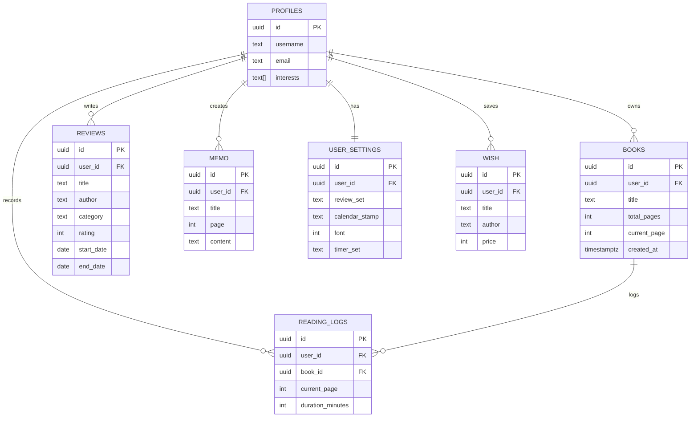

# 책담 2 (Bookdam 2)
### 개인화 독서 리뷰 서비스

책담 2는 사용자가 책을 읽고 리뷰를 기록하는 데서 끝나지 않고,<br />
**지속적인 독서 습관 형성과 성취감을 경험할 수 있도록 설계된 개인화 독서 기록 서비스**입니다.<br /><br />

단순 리뷰 기능을 넘어<br />
스탬프, 개인화 추천, 메모, 스톱워치 등의 기능을 통해<br />
책을 읽고 덮는 순간이 아닌, **오랫동안 기억에 남는 독서 경험**을 만드는 것을 목표로 했습니다.
<br />

### 미리보기


<br />


<br />


<br />


<br />

### 주요 기능

- 리뷰 기반 책 추천<br />
최신 리뷰한 도서의 카테고리를 기준으로 책 추천<br />
리뷰 데이터가 없을 경우 에디터 추천 도서 노출<br />
(Aladin API 사용)

- 관심사 기반 책 추천<br />
회원가입 시 선택한 관심 카테고리를 기반으로 개인화 추천 제공<br />
(Aladin API 사용)

- 독서 스탬프<br />
책 완독 날짜를 기준으로 캘린더에 스탬프를 기록해<br />
독서 성취감을 시각적으로 제공<br />

- 메모 기능<br />
인상 깊었던 문장이나 생각을 자유롭게 기록 가능
<br />

### 기술 스택

#### Frontend
- Next.js (App Router)
  - 서버/클라이언트 컴포넌트 분리를 통해 초기 데이터 패칭 속도 개선
  - 폴더 기반 라우팅으로 서브 페이지 구조 유연하게 구성

#### Backend
- Supabase
    - 인증(회원가입/로그인) 기능을 활용한 사용자 데이터 개인화
    - 관계형 데이터베이스 기반으로 백엔드 서버 없이 데이터 관리

#### State Management
- Zustand
    - Context 대비 간결한 상태 관리
    - CRUD 처리 후 상태를 즉시 동기화하여 UI 반영

#### External API
- Aladin Open API
    - 도서 정보 및 추천 데이터 제공
 
<br />

### Schema Visualizer

Supabase 기반으로 설계한 데이터베이스 구조입니다.<br />
사용자 중심의 개인화 서비스를 고려해 모든 주요 테이블은 user_id를 기준으로 관계를 맺고 있습니다.



<br />

### 프로젝트 포인트

- 동일 서비스의 HTML → Next.js 리팩토링 경험
  - 단순 기술 교체가 아닌, 구조 재설계를 통한 기능 확장

- 리팩토링을 통해 가능해진 기능
  - CRUD 기능 구현
  - 회원 기반 개인화 서비스
  - 추천 시스템, 스톱워치 등 기능 확장

- 성능 개선
  - 초기 데이터 패치 구조 개선
  - 동일 배포 환경 기준 Network 로딩 시간 단축 확인 (HTML: 13.35s → Next.js: 4.90s)
 
<br />

### 실행 방법

```
npm install
npm run dev
```
환경 변수 설정은 Supabase 및 Aladin API 키가 필요합니다.

[🚀 배포 주소 바로가기](https://bookdam-ver2.vercel.app/)

<br />
### 트러블슈팅

- **폼 유효성 검사 & 리렌더링 최적화**  
  onBlur → onChange 전환 과정에서 발생한 렌더링 이슈를 분석하고  
  react-hook-form 도입으로 UX와 유지보수성을 동시에 개선  
  → 자세한 내용: 포트폴리오 참고

- **썸네일 API 호출 구조 개선**  
  컴포넌트 단위 API 호출로 인한 간헐적 에러 발생  
  데이터 패치 책임을 상위 컴포넌트로 승격해 병렬 처리 구조로 개선  
  → 자세한 내용: 포트폴리오 참고

- **에러 처리 구조 재설계**  
  데이터 없음과 에러 상태를 명확히 분리하고  
  서버–페이지–컴포넌트 단위 에러 바운더리 적용

- **모달 중첩 구조 접근성 문제 해결**  
  중첩 모달에서 포커스 트랩이 깨지는 문제를 구조 분리로 해결

